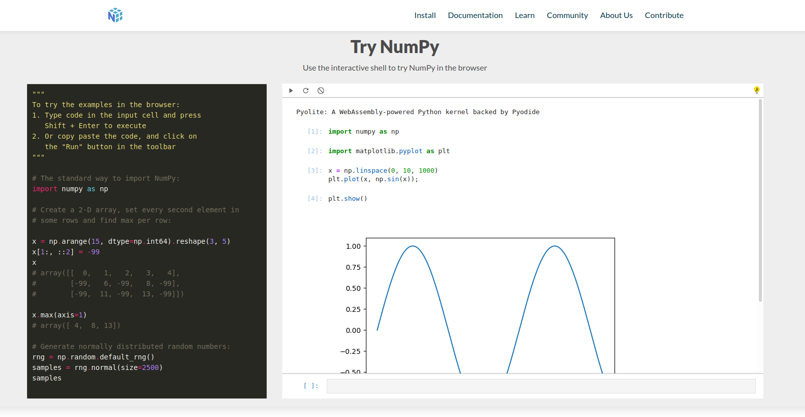
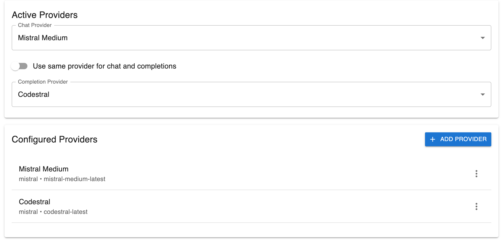
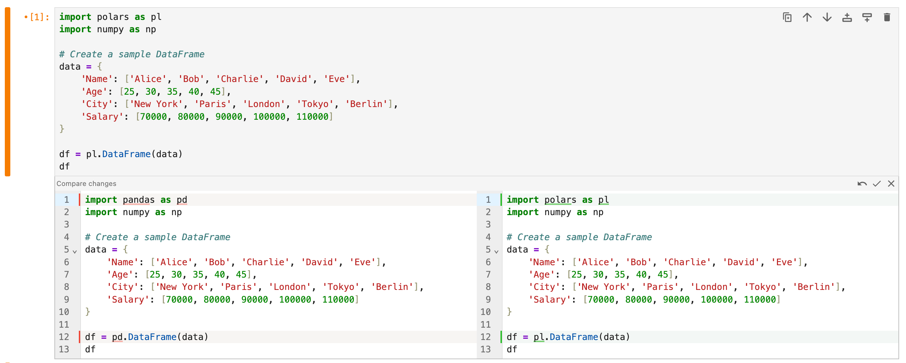
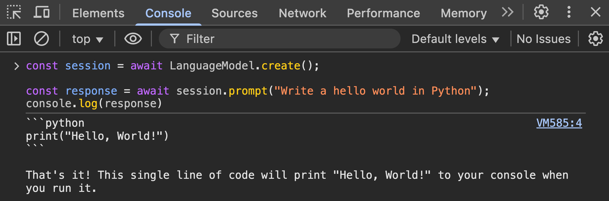
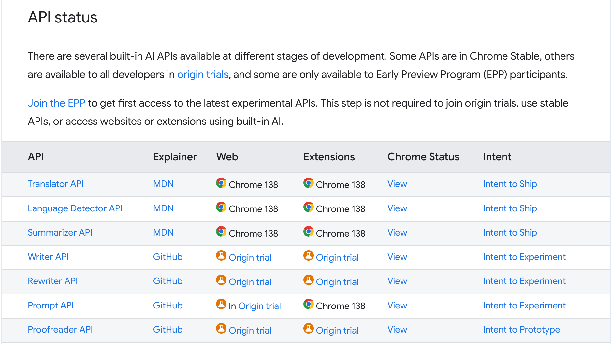
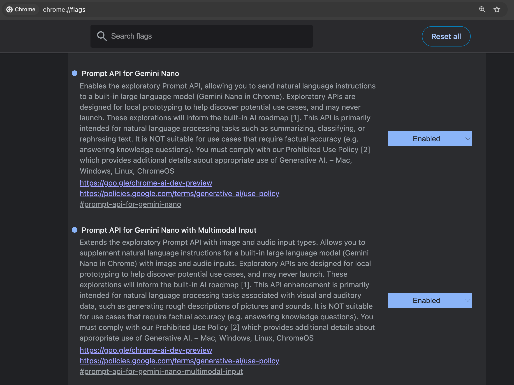

# Browser-based AI workflows in Jupyter

## PyData Paris 2025

### 2025-09-30

Jeremy Tuloup
Nicolas Brichet

---

# About

- Jeremy Tuloup
- Nicolas Brichet
- QuantStack

---

# AI in Jupyter

## The state in 2025

- Jupyter AI: https://github.com/jupyterlab/jupyter-ai
  - Still incubating under JupyterLab
  - Stable: v2 - code completions, chat, magics
  - Beta: v3 - personas (agents), MCP, RTC
- Notebook Intelligence: https://github.com/notebook-intelligence/notebook-intelligence
 - Independent project
 - GitHub copilot, agents, MCP

---

# The AI space is moving (very) fast

- What about JupyterLite?
- AI in the browser?

---

# Forward-looking view on AI in Jupyter

---

# Agenda

TODO

---

# What is JupyterLite?

> JupyterLite is a JupyterLab distribution that runs entirely in the web browser, backed by in-browser language kernels.

---

# Lightweight Jupyter Frontend running in the browser

- ✅ can be hosted as a static website
- ✅ no need to install Python and other packages on the user machine
- ✅ kernels run in the browser via WebAssembly (Pyodide, Emscripten Forge)
- ✅ easy to embed a live Python console on your website

---

# How to integrate AI in JupyterLite?

---

# Chat with Remote Models

Connect to AI providers, directly from your browser:

- Anthropic
- OpenAI
- Mistral
- Ollama
- More via extensions

---

  Give suggestions to make the plot look nicer
  <button class="copy-btn" onclick="navigator.clipboard.writeText(this.parentElement.firstChild.textContent.trim())">
    Copy
  </button>

---

TODO: screencast

---

# Code completion

---

TODO: screencast

---

# Agent Mode

- Easily create new notebooks
- Tool calling
- Approve or reject tool calls

---

  Create a demo notebook about pandas and matplotlib
  <button class="copy-btn" onclick="navigator.clipboard.writeText(this.parentElement.firstChild.textContent.trim())">
    Copy
  </button>

  Now clear all the outputs and run all the cells in the notebook
  <button class="copy-btn" onclick="navigator.clipboard.writeText(this.parentElement.firstChild.textContent.trim())">
    Copy
  </button>

---

TODO: screencast

---

# Accept / Reject Diffs

`jupyterlab-cell-diff` provides a command to display diffs under input cells:

---

  Use of `pandas` with `polars` in this cell
  <button class="copy-btn" onclick="navigator.clipboard.writeText(this.parentElement.firstChild.textContent.trim())">
    Copy
  </button>

---

TODO: screencast for showing diffs

---

# Execute JupyterLab Commands

- Expose JupyterLab commands as `tools` to the agent.
  - `discover_commands` to find available commands
  - `execute_command` to execute a command

---

# JupyterLab Commands

- "toggle the right area"
- "show the about dialog"
- "create a new chess pawn in jupytercad"

---

  Create an empty .jcad file. Once opened, build a chess pawn, step by step, using the available jupytercad commands
  <button class="copy-btn" onclick="navigator.clipboard.writeText(this.parentElement.firstChild.textContent.trim())">
    Copy
  </button>

---

TODO: screencast with JupyterCad

---

# Model Context Protocol (MCP)

- Open-source standard for connecting AI applications to external systems:
  - Tools
  - Resources
  - Prompts

> Think of MCP like a USB-C port for AI applications. Just as USB-C provides a standardized way to connect electronic devices, MCP provides a standardized way to connect AI applications to external systems.

https://modelcontextprotocol.io

---

# Remote MCP Servers

- The server is hosted somewhere else
- Available from any MCP client with an internet connection
- Ideal for web-based AI applications

---

TODO: screencast with DeepWiki

---

# LLMs in the Browser

- Run models directly in browser
- No server dependencies
- Privacy-focused: no requests to external servers

---

# In-Browser AI libraries

<table>
  <tr>
    <td style="text-align: center;"></td>
    <td style="text-align: center;"><a href="https://webllm.mlc.ai">WebLLM</a></td>
  </tr>
  <tr>
    <td style="text-align: center;"></td>
    <td style="text-align: center;"><a href="https://huggingface.github.io/transformers.js">Transformers.js</a></td>
  </tr>
</table>

---

# WebLLM Demo

TODO: screencast

---

# Built-in AI

- Chrome: Gemini Nano
- Edge: Phi-4-mini

---

---

---

---

# Not just about code

ChromeAI Multimodal capabilities:

- Generate alt text for images
- Transcribe audio to text

---

TODO: screencast fot alt text generation

---

TODO: screencast for audio transcription

---

# The Case of Privacy

- Data stays in the browser
- No server round-trips
- Enhanced privacy protection

---

# Limitations of In-Browser AI

- Model size
- The model must be downloaded before use
- Performance
- Browser, flags and hardware compatibility

---

# Secrets Management

- Store secrets in the browser
- Or use the secrets manager for custom connectors:
  - https://github.com/jupyterlab-contrib/jupyter-secrets-manager

---

# Building blocks for AI in Jupyter

- Towards modular and extensible components:
  - https://github.com/orgs/jupyter-ai-contrib/discussions/1
- Extension authors can extend functionality via JupyterLab commands
- Hybrid workflows (server + browser)

---

# What's Next?

- Support for more models and providers
- CLI tools via `jupyterlite-terminal`
- Real Time Collaboration and chat

---

# References

- Presentation: https://github.com/jtpio/pydata-paris-2025
- Live version: https://jtpio.github.io/pydata-paris-2025/files/index.html
