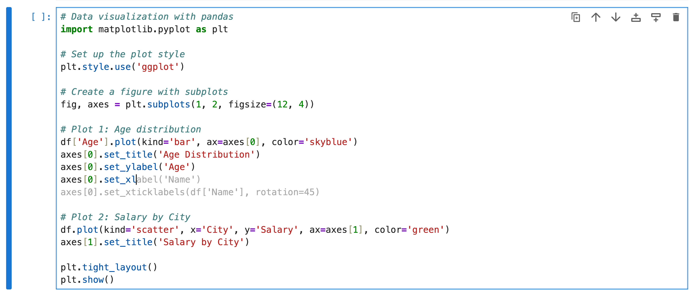

# Browser-based AI workflows in Jupyter

## PyData Paris 2025

### 2025-09-30

Jeremy Tuloup
Nicolas Brichet

---

# About

- Jeremy Tuloup
- Nicolas Brichet
- QuantStack

---

# The AI space is moving (very) fast

- New models
- IDE integrations
- CLI, TUI

---

# AI in Jupyter

## The state in 2025

- Jupyter AI: https://github.com/jupyterlab/jupyter-ai
  - Incubating under JupyterLab
  - Stable (v2) - code completions, chat, magics
  - Beta (v3) - personas (agents), MCP, RTC
- Notebook Intelligence: https://github.com/notebook-intelligence/notebook-intelligence
  - Independent project
  - GitHub copilot, agents, MCP

---

# AI integration in the browser?

- What about JupyterLite?
- Using AI models in the browser?

---

# Forward-looking view on AI in Jupyter

---

# Agenda

- **JupyterLite**
- **Remote AI Models**
- **Agent Mode**
- **Model Context Protocol**
- **In-Browser LLMs**
- **Built-in AI**
- **Privacy & Limitations**
- **What's Next?**

---

# What is JupyterLite?

> JupyterLite is a JupyterLab distribution that runs entirely in the web browser, backed by in-browser language kernels.

---

# Lightweight Jupyter running in the browser

- ✅ can be hosted as a static website
- ✅ no need to install Python and other packages on the user machine
- ✅ kernels run in the browser via WebAssembly (Pyodide, Emscripten Forge)
- ✅ easy to embed a live Python console on your website

---

# How to integrate AI in JupyterLite?

https://github.com/jupyterlite/ai

---

# Chat with Remote Models

Connect to AI providers, directly from your browser (without a Python server)

- Anthropic
- OpenAI
- Mistral
- Ollama
- More via extensions

---

  Give me the Python code to print the Fibonacci sequence
  <button class="copy-btn" onclick="navigator.clipboard.writeText(this.parentElement.firstChild.textContent.trim())">
    Copy
  </button>

---

# Code completion

---

---

# Agent Mode

- Create new notebooks
- Tool calling
- Approve or reject tool calls

---

  Create a demo notebook about pandas and matplotlib
  <button class="copy-btn" onclick="navigator.clipboard.writeText(this.parentElement.firstChild.textContent.trim())">
    Copy
  </button>

  Now clear all the outputs and run all the cells in the notebook
  <button class="copy-btn" onclick="navigator.clipboard.writeText(this.parentElement.firstChild.textContent.trim())">
    Copy
  </button>

---

<video
  controls
  width="100%"
  height="600px"
  src="https://github.com/user-attachments/assets/e33d7d84-53ca-4835-a034-b6757476c98b">
</video>

---

# Accept / Reject Diffs

`jupyterlab-cell-diff` provides a command to display diffs below input cells:

---

  Use `polars` instead of `pandas` in the current cell
  <button class="copy-btn" onclick="navigator.clipboard.writeText(this.parentElement.firstChild.textContent.trim())">
    Copy
  </button>

---

<video
  controls
  width="100%"
  height="600px"
  src="https://github.com/user-attachments/assets/329af10f-b602-4be6-9adf-636c2fa7de94">
</video>

---

# Execute JupyterLab Commands

- Expose JupyterLab commands as `tools` to the agent:
  - `discover_commands` to find available commands
  - `execute_command` to execute a command

---

# Control JupyterLab with natural language

- "toggle the right area"
- "show the about dialog"
- "create a new chess pawn in jupytercad"

---

  Create an empty .jcad file. Once opened, build a chess pawn, step by step, using the available jupytercad commands
  <button class="copy-btn" onclick="navigator.clipboard.writeText(this.parentElement.firstChild.textContent.trim())">
    Copy
  </button>

---

<video
  controls
  width="100%"
  height="600px"
  src="https://github.com/user-attachments/assets/1bebdc78-c26f-4b63-9b7c-24bf14cc6a21">
</video>

---

# Model Context Protocol (MCP)

- Open-source standard for connecting AI applications to external systems:
  - Tools
  - Resources
  - Prompts

> Think of MCP like a USB-C port for AI applications. Just as USB-C provides a standardized way to connect electronic devices, MCP provides a standardized way to connect AI applications to external systems.

https://modelcontextprotocol.io

---

# Remote MCP Servers

- The server is hosted somewhere else
- Available from any MCP client with an internet connection
- Ideal for web-based AI applications

---

<video
  controls
  width="100%"
  height="600px"
  src="https://github.com/user-attachments/assets/b0c6f37c-9dc8-493d-9fe8-4ef53ab77fd8">
</video>

---

# LLMs in the Browser

- Run models directly in the browser
- No server dependencies
- Privacy-focused: no requests to external servers

---

# In-Browser AI libraries

<table>
  <tr>
    <td style="text-align: center;"></td>
    <td style="text-align: center;"><a href="https://webllm.mlc.ai">WebLLM</a></td>
  </tr>
  <tr>
    <td style="text-align: center;"></td>
    <td style="text-align: center;"><a href="https://huggingface.co/docs/transformers.js/index">Transformers.js</a></td>
  </tr>
</table>

---

<video
  controls
  width="100%"
  height="600px"
  src="https://github.com/user-attachments/assets/c9dd79c2-99bf-4c4e-b4b8-9b1cf76fc165">
</video>

---

# Built-in AI

- Chrome: Gemini Nano
- Edge: Phi-4-mini

---

---

---

---

# Not just about code

ChromeAI multimodal capabilities:

- Generate alt text for images
- Transcribe audio to text

---

<video
  controls
  width="100%"
  height="600px"
  src="https://github.com/user-attachments/assets/da53a662-af35-4302-b72f-dcf9eecefb45">
</video>

---

<video
  controls
  width="100%"
  height="600px"
  src="https://github.com/user-attachments/assets/1ffab2d6-94f3-4b53-abac-374f0adc33b7">
</video>

---

# The Case of Privacy

- Data stays in the browser
- No server round-trips
- Enhanced privacy protection

---

# Limitations of browser-based AI

- Model size (300MB - 1GB - 22GB)
- The model must be downloaded before use
- Performance (requires good hardware)
- Browser, flags and hardware compatibility
- MCP:
  - Some remote MCP servers can work
  - https://github.com/webmachinelearning/webmcp

---

# Secrets Management

- Store secrets in the browser (unsafe)
- Or use the secrets manager with custom connectors:
  - https://github.com/jupyterlab-contrib/jupyter-secrets-manager

---

# What's Next in lite?

- CLI tools via `jupyterlite-terminal`
- Real Time Collaboration and chat
- Multi chats / multi models

---

# Building blocks for AI in Jupyter

- Towards modular and extensible components:
  - https://github.com/orgs/jupyter-ai-contrib/discussions/1
- Extension authors can extend functionality via JupyterLab commands
- Hybrid workflows (server + browser)

---

# References

- Presentation: https://github.com/jtpio/pydata-paris-2025
- Live version: https://jtpio.github.io/pydata-paris-2025/files/index.html
